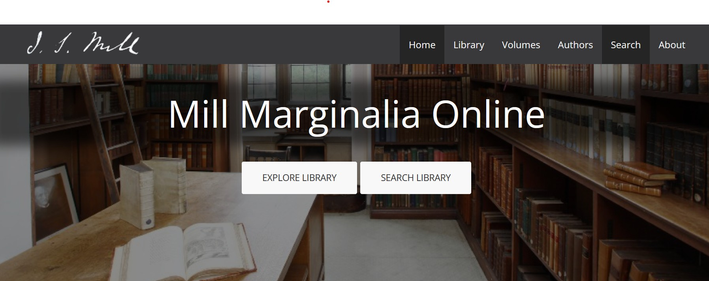
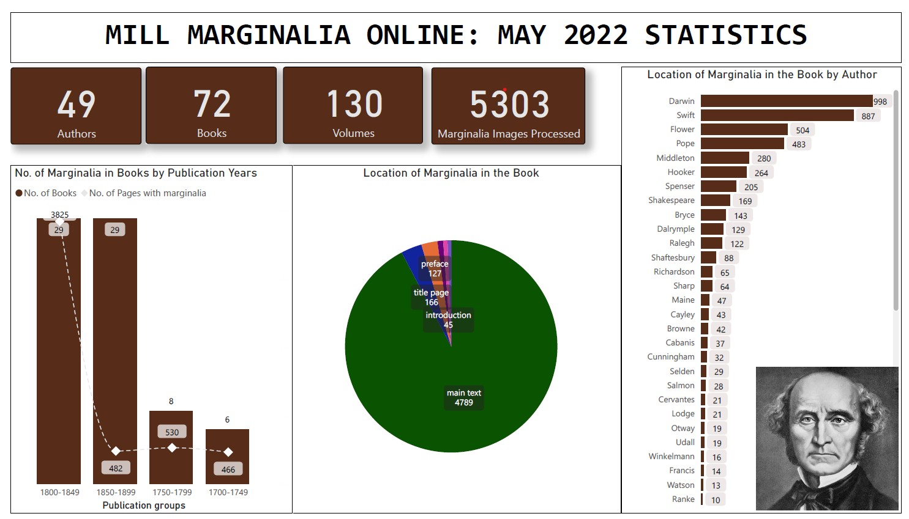
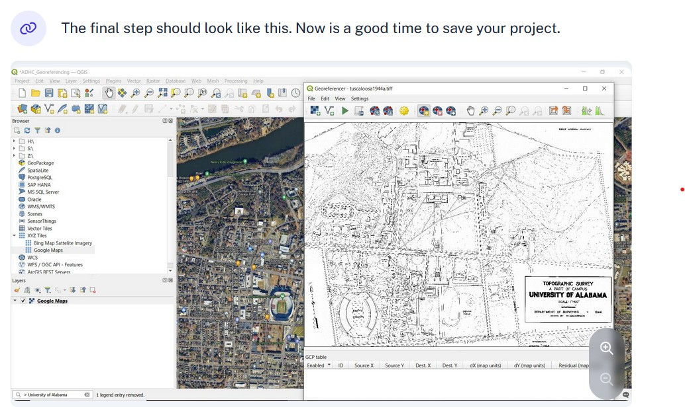
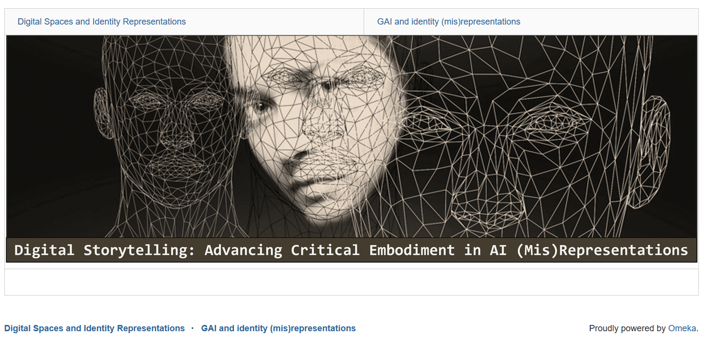
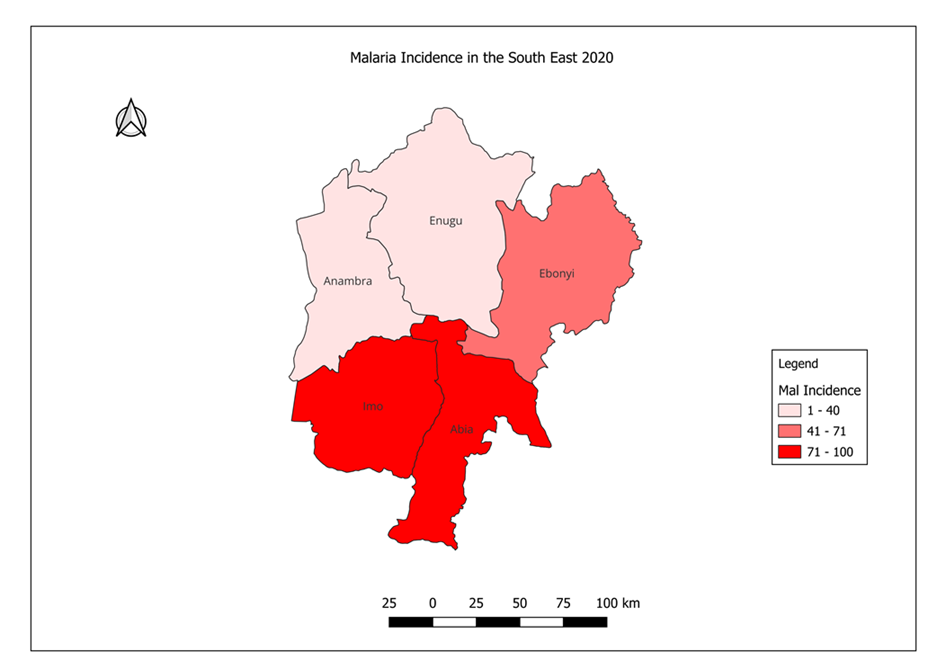

## Projects

### I. [Mill Marginalia](https://millmarginalia.org/)

**Public Humanities / Digital Humanities Project - Fall '23 - Spring '24**
* A multi-faceted open access digital resource showcasing the manuscript marginalia written in texts by both J. S. Mill and his father, enabling researchers and students to read these alongside scholarly writing about these materials.*

As a research assistant on this digitization project, Reliance devloped a visualization dashboard, digitized marginalia, and contributed to the development of technical documentation and articles to the [blog](https://blog.millmarginalia.org/)
  
- Utilized Power BI and MS Excel for data analysis, cleaning, and visualization
- Engaged with Adobe for marginalia digitization

## II. [Georeferencing Maps](https://adhc.lib.ua.edu/mapathon-day-02-georeferencing-maps-in-qgis/)
**Public Humanities / Digital Humanities Project - Summer '24**

*A mapathon-focused series aimed at providing a practical guide for mapathon participants on practical elements that will enable them complete the georeferencing task on a scanned image of a map.*

- Utilized Geographic Information Systems tools- QGIS for georeferncing Tuscaloosa maps
- Integrated Scribe for georeferencing documentation

## III. [Digital Storytelling & Critical Digital Literacy](https://criticaldigitalliteracies.omeka.net/)

**GenAI Literacy / Rhetoric and Composition / Pedagogical Research / Web Design Project - Spring '25**

*This project explores digital storytelling and embodiment in AI technologies. This website was build as part of my master's capstone advancing critical embodiment in AI (mis)representations.*

- Built using Omeka, Canva, and MS PowerPoint 
- Prompt engineering via Wepik AI, Adobe AI, Dall-E
- Content analysis of AI misrepresentations in Wepik AI, Adobe AI, Dall-E

## IV. Mapping Epidemic Discourse in Nigeria

**Risk Communications / Health Humanities / Independent Project - Summer '25**

*Spatial analysis and visualization of Malaria incidence in Nigeria with focus on the South Eastern region*
*Design an interactive map to visualize temperature interpolation in Nigeria, July 2025*

- Engaged QGIS, ArcGIS, and MS PowerPoint 
- Built data collection forms using ODK / KoboCollect

## V. Portfolio Design and Development  
**Web Design Project — Ongoing**  
*Building a personal academic portfolio with GitHub Pages and Jekyll.*

Designed this digital portfolio to reflect professional identity and showcase interdisciplinary research, teaching, and creative work. The site emphasizes accessibility, clean typography, and responsive design principles.

- Implemented in Markdown and HTML using Jekyll and GitHub Pages  
- Customized minimal theme with navigation bar, tags, and integrated analytics  
- Version controlled using Git and GitHub  

💻 **Source Code:** [GitHub Repository](https://relianceenwerem.github.io/my-portfolio/)