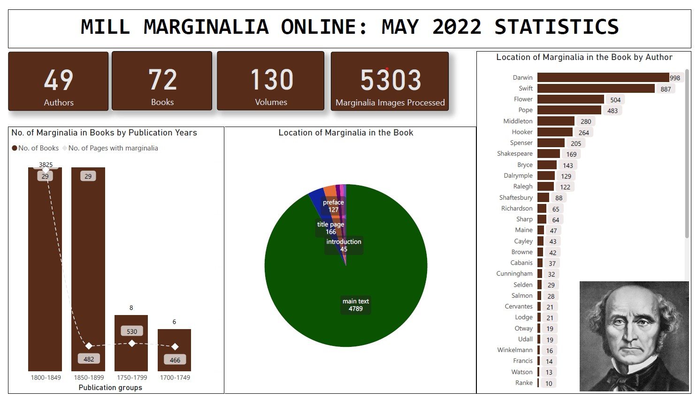
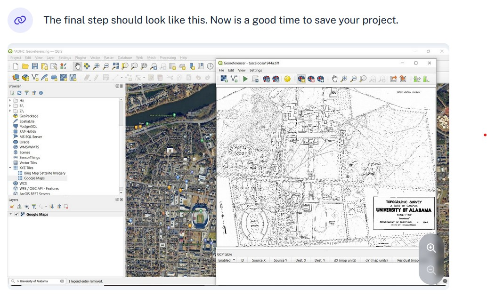
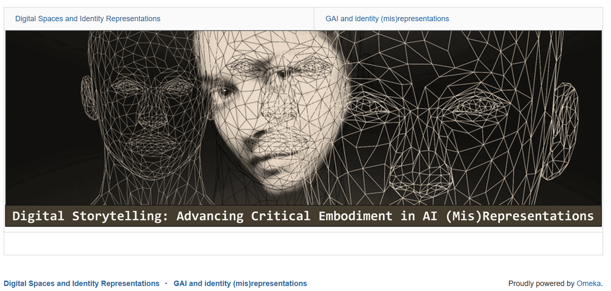
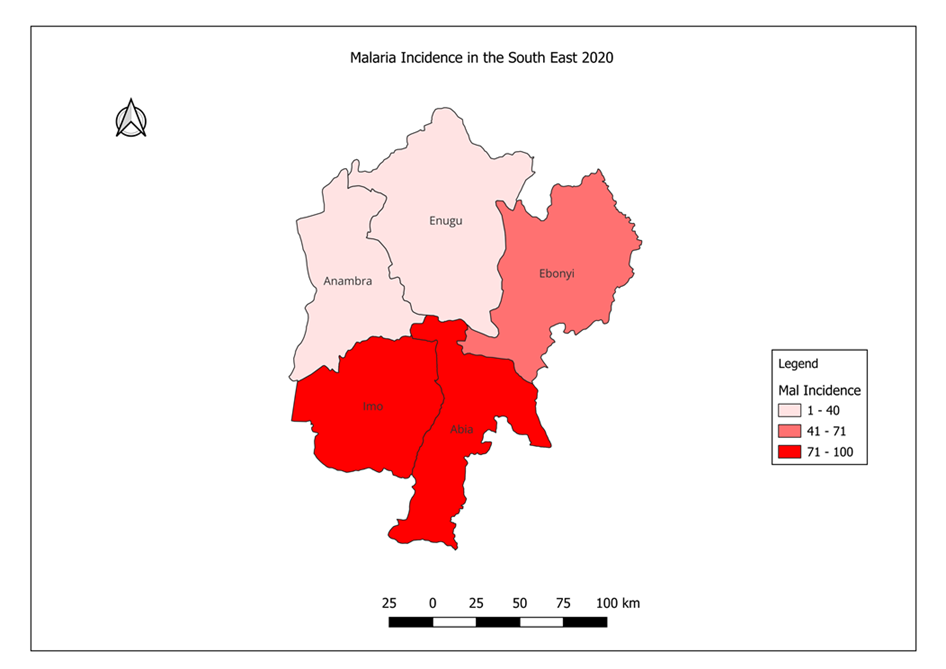

## Projects

Click a project to expand its full overview.

  

    

      
      I
      Mill Marginalia
      Public / Digital Humanities
      Fall '23 – Spring '24
    

    

      
<a href="https://millmarginalia.org/">Visit the project site &nearr;</a>

      
<em>A multi-faceted open access digital resource showcasing the manuscript marginalia written in texts by both J. S. Mill and his father, enabling researchers and students to read these alongside scholarly writing about these materials.</em>

      
      
As a research assistant on this digitization project, Reliance developed a visualization dashboard, digitized marginalia, and contributed to the development of technical documentation and articles to the <a href="https://blog.millmarginalia.org/">blog</a>.

      <ul>
        <li>Utilized Power BI and MS Excel for data analysis, cleaning, and visualization</li>
        <li>Engaged with Adobe for marginalia digitization</li>
        <li>Documented marginalia digitization processes</li>
      </ul>
    

  

  

    

      
      II
      Documentation for Georeferenced Maps
      Public / Digital Humanities
      Summer '24
    

    

      
<a href="https://adhc.lib.ua.edu/mapathon-day-02-georeferencing-maps-in-qgis/">Visit the documentation &nearr;</a>

      
<em>A mapathon-focused series aimed at providing a practical guide for mapathon participants on practical elements that will enable them complete the georeferencing task on a scanned image of a map.</em>

      <ul>
        <li>Utilized Scribe for georeferencing documentation</li>
        <li>Engaged Geographic Information Systems tools — QGIS for georeferencing Tuscaloosa maps</li>
      </ul>
    

  

  

    

      
      III
      Digital Storytelling &amp; Critical Digital Literacy
      GenAI Literacy / Web Design
      Spring '25
    

    

      
<a href="https://criticaldigitalliteracies.omeka.net/">Visit the project site &nearr;</a>

      
<em>This project explores digital storytelling and embodiment in AI technologies. This website was built as part of my master's capstone advancing critical embodiment in AI (mis)representations.</em>

      <ul>
        <li>Built using Omeka, Canva, and MS PowerPoint</li>
        <li>Prompt engineering via Wepik AI, Adobe AI, Dall-E</li>
        <li>Content analysis of AI misrepresentations in Wepik AI, Adobe AI, Dall-E</li>
      </ul>
    

  

  

    

      
      IV
      Mapping Epidemic Discourse in Nigeria
      Risk Communication / Health Humanities
      Summer '25
    

    

      
<em>Spatial analysis and visualization of Malaria incidence in Nigeria with focus on the South Eastern region.</em>

      
      
      <ul>
        <li>Engaged QGIS, ArcGIS, and MS PowerPoint</li>
        <li>Built data collection forms using ODK / KoboCollect</li>
      </ul>
    

  

  

    

      
      V
      Portfolio Design and Development
      Web Design
      Ongoing
    

    

      
<em>Building a personal academic portfolio with GitHub Pages and Jekyll.</em>

      
Designed this digital portfolio to reflect professional identity and showcase interdisciplinary research, teaching, and creative work. The site emphasizes accessibility, clean typography, and responsive design principles.

      <ul>
        <li>Implemented in Markdown and HTML using Jekyll and GitHub Pages</li>
        <li>Customized minimal theme with navigation bar, tags, and integrated analytics</li>
        <li>Version controlled using Git and GitHub</li>
      </ul>
      
💻 <strong>Source Code:</strong> <a href="https://relianceenwerem.github.io/my-portfolio/">GitHub Repository</a>

    

  

  

    

      
      VI
      Rehumanizing Data: An Interactive Word-Cone
      Digital Humanities / Interactive Design
      Spring '26
    

    

      
<em>An interactive 3D visualization built with p5.js (WebGL). Words from a research paper abstract are placed on a rotating cone surface, exploring how embodied spatial form can rehumanize abstracted data.</em>

      
<strong>Controls:</strong> Click and drag to rotate · Double-click to toggle auto-rotation

      

      <ul>
        <li>Implemented in Markdown and HTML using Jekyll and GitHub Pages</li>
        <li>Customized minimal theme with navigation bar, tags, and integrated analytics</li>
        <li>Version controlled using Git and GitHub</li>
      </ul>
      
💻 <strong>Source Code:</strong> <a href="https://relianceenwerem.github.io/my-portfolio/">GitHub Repository</a>

    

  

